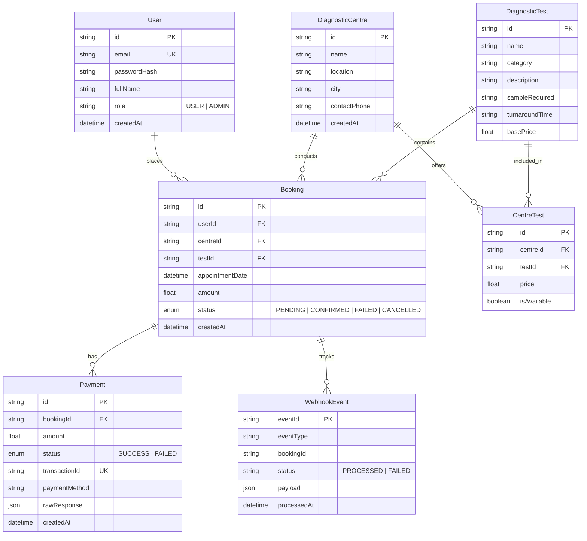

# EVE Healthcare — Diagnostic Test Booking & Payment Backend Service

[](https://nodejs.org)
[](https://www.typescriptlang.org/)
[](https://expressjs.com/)
[](https://www.postgresql.org/)
[](https://www.prisma.io/)
[](http://localhost:5000/api-docs)
[](https://jestjs.io/)

---

## Table of Contents
1. [Architecture & Tech Stack](#1-architecture--tech-stack)
2. [Database Schema & Data Model](#2-database-schema--data-model)
3. [Edge-Case Handling & Robustness Matrix](#3-edge-case-handling--robustness-matrix)
4. [Idempotent Webhook Architecture](#4-idempotent-webhook-architecture)
5. [Quick Start & Local Setup](#5-quick-start--local-setup)
   - [Option A: Docker & Docker Compose (Recommended)](#option-a-docker--docker-compose-recommended)
   - [Option B: Local Node.js Development](#option-b-local-nodejs-development)
6. [Interactive React Demo Dashboard](#6-interactive-react-demo-dashboard)
7. [Running Automated Tests](#7-running-automated-tests)
8. [API Endpoints & Example Requests](#8-api-endpoints--example-requests)
9. [Pre-Seeded Demo Credentials](#9-pre-seeded-demo-credentials)
10. [Assumptions Made](#10-assumptions-made)
11. [What Would Be Improved With More Time](#11-what-would-be-improved-with-more-time)

---

## 1. Architecture & Tech Stack

The service is built with a layered, decoupled architecture designed for readability, testability, and ease of explanation during technical interviews:

- **Runtime & Language**: Node.js & TypeScript
- **Web Framework**: Express.js
- **Database & ORM**: PostgreSQL with Prisma ORM
- **Request Validation**: Zod (strict schema enforcement with friendly field-level errors)
- **Security & Authentication**: JWT (JSON Web Tokens) + `bcryptjs` password hashing + Express Rate Limiting
- **API Documentation**: OpenAPI / Swagger UI at `/api-docs`
- **Testing**: Jest + Supertest (36 unit and integration tests)
- **Containerization**: Docker & Docker Compose
- **Client**: Interactive React (Vite + Tailwind CSS) dashboard for visual simulation

### Architectural Layering

```
Request ──▶ Rate Limiter ──▶ Auth Middleware (JWT) ──▶ Zod Validator
                                                            │
Global Error Handler ◀── Controller Layer ◀── Service Layer ◀┘
         ▲                                          │
         └──────── AppError / Operational ◀─────────┴──▶ Prisma ORM ──▶ PostgreSQL
```

---

## 2. Database Schema & Data Model

The schema is modeled in PostgreSQL using Prisma (`prisma/schema.prisma`):



### Key Modeling Highlights
1. **Catalog vs. Centre Pricing (`CentreTest`)**: Medical tests (e.g., *Complete Blood Count*) belong to a global catalog (`DiagnosticTest`), but individual diagnostic centres set their own local pricing and availability via `CentreTest`.
2. **Server-Enforced Amount**: When a booking is created, the price is looked up from `CentreTest` and recorded on `Booking.amount`. This prevents client-side price tampering.
3. **Dedicated `WebhookEvent` Table**: Stores processed gateway event IDs to guarantee absolute idempotency.

---

## 3. Edge-Case Handling & Robustness Matrix

| Edge Case Scenario | Layer Handled | Status Code | Mechanism / Resolution |
| :--- | :--- | :--- | :--- |
| **Invalid request payload** | Zod Middleware | `400 Bad Request` | Returns array of exact invalid fields with human-readable error messages. |
| **Duplicate user signup** | Service + DB Unique | `409 Conflict` | Catches duplicate email gracefully without crashing or leaking DB details. |
| **Past appointment date** | Zod Refinement | `400 Bad Request` | Enforces that `appointmentDate` must be strictly in the future (`> Date.now()`). |
| **Test unavailable at centre** | Booking Service | `400 Bad Request` | Verifies `centreId` + `testId` link exists and `isAvailable == true`. |
| **Price tampering from client** | Booking Service | N/A | Ignores any client-supplied amount; computes verified price directly from DB. |
| **Accessing another user's booking** | Booking Service | `403 Forbidden` | Compares `booking.userId !== req.user.userId` (unless `ADMIN`). |
| **Paying for already CONFIRMED booking** | Payment Service | `400 Bad Request` | State machine guard prevents double-charging. |
| **Paying for a CANCELLED booking** | Payment Service | `400 Bad Request` | Rejects payment initiation on invalidated bookings. |
| **Cancelling a CANCELLED or FAILED booking** | Booking Service | `400 Bad Request` | Only `PENDING` or `CONFIRMED` bookings can be cancelled. |
| **Repeated / Duplicate Webhook deliveries** | Webhook Service | `200 OK` | Detects duplicate `eventId` via DB unique check; returns idempotent bypass response without duplicate payments or corrupting state. |
| **Webhook for non-existent booking** | Webhook Service | `404 Not Found` | Records failed audit log and exits cleanly. |
| **Malformed JSON in request** | Error Middleware | `400 Bad Request` | Catches syntax errors before hitting route handlers. |
| **Expired or invalid JWT** | Auth Middleware | `401 Unauthorized` | Rejects unauthenticated requests with clean message. |
| **Brute-force / spam protection** | Rate Limiter | `429 Too Many Requests`| Limits repeated auth and general API requests per IP window. |

---


## 4. Quick Start & Local Setup

### Option A: Docker & Docker Compose (Recommended)

Requires Docker Desktop installed.

```bash
# 1. Clone repository
git clone <repo-url>
cd diagnostic

# 2. Start PostgreSQL and the API service in one command
docker compose up --build -d

# 3. View logs
docker compose logs -f api
```

The service will automatically:
1. Spin up PostgreSQL.
2. Push the Prisma schema.
3. Run the API on `http://localhost:5000`.
4. Swagger UI will be live at `http://localhost:5000/api-docs`.

---

### Option B: Local Node.js Development

#### Prerequisites
- Node.js (v18+)
- PostgreSQL (or use Docker for DB: `docker run --name pg-test -e POSTGRES_PASSWORD=postgres -p 5432:5432 -d postgres:15-alpine`)

```bash
# 1. Install dependencies
npm install

# 2. Configure environment
cp .env.example .env

# 3. Push schema to database
npx prisma db push

# 4. Seed database with realistic diagnostic centres, tests, and users
npm run prisma:seed

# 5. Start dev server with hot reload
npm run dev
```

The server will start at: `http://localhost:5000`

---

## 5. Interactive React Demo Dashboard

To visually demo diagnostic bookings, test selection, payment simulation, and duplicate webhook idempotency:

```bash
# In another terminal window:
cd client
npm install
npm run dev
```

Open **`http://localhost:3000`** in your browser:
- **1-Click Demo Login**: Pre-fills patient credentials (`patient@evehealthcare.com` / `Password123`).
- **Live Test Booking**: Choose centre, select test (shows price and sample type), pick future appointment.
- **Payment Simulation Buttons**: Click "Simulate Pay (Success)" or "Simulate Pay (Fail)".
- **Idempotency Testing**: Click "Send Webhook", then click **"Send Duplicate (Test Idempotency)"** to see live proof that duplicate events are safely ignored with a 200 OK response!

---

## 6. Running Automated Tests

A comprehensive test suite of **36 unit and integration tests** is included using Jest and Supertest.

```bash
npm test
```

### Test Coverage Highlights
- `tests/auth.test.ts`: Signup, login, password validation, duplicate email rejection (409), JWT authentication.
- `tests/centre.test.ts`: Centres listing, pagination metadata, search filtering, centre details with tests and prices, 404/400 validation.
- `tests/booking.test.ts`: Creation, past date rejection, centre-test availability, ownership check (403), state-guarded cancellation.
- `tests/payment.test.ts`: Successful payments, failed payments, state validation (cannot pay for confirmed or cancelled bookings), ownership authorization.
- `tests/webhook.test.ts`: **Idempotency verification**, duplicate event handling, invalid payload structure (400), non-existent bookings (404).

---

## 7. API Endpoints & Example Requests

Interactive Swagger UI is accessible at: **`http://localhost:5000/api-docs`**

### 1. Authentication

#### User Signup
```bash
curl -X POST http://localhost:5000/api/auth/signup \
  -H "Content-Type: application/json" \
  -d '{
    "fullName": "Aarav Sharma",
    "email": "aarav@example.com",
    "password": "Password123",
    "phone": "+919876543210"
  }'
```

#### User Login
```bash
curl -X POST http://localhost:5000/api/auth/login \
  -H "Content-Type: application/json" \
  -d '{
    "email": "patient@evehealthcare.com",
    "password": "Password123"
  }'
```
*Returns `{ token: "...", user: {...} }`*

---

### 2. Diagnostic Centres & Tests

#### List Diagnostic Centres (with Search & Pagination)
```bash
curl -X GET "http://localhost:5000/api/centres?city=Mumbai&page=1&limit=10"
```

#### Get Centre Details & Available Tests with Pricing
```bash
curl -X GET "http://localhost:5000/api/centres/<CENTRE_UUID>"
```

#### List Diagnostic Tests Catalogue
```bash
curl -X GET "http://localhost:5000/api/centres/tests"
```

---

### 3. Bookings

#### Create a Booking (Protected)
```bash
curl -X POST http://localhost:5000/api/bookings \
  -H "Content-Type: application/json" \
  -H "Authorization: Bearer <YOUR_JWT_TOKEN>" \
  -d '{
    "centreId": "<CENTRE_UUID>",
    "testId": "<TEST_UUID>",
    "appointmentDate": "2026-10-15T09:30:00.000Z",
    "notes": "Fasting 12 hours prior"
  }'
```
*Initial status is `PENDING`.*

#### List My Bookings (Protected)
```bash
curl -X GET "http://localhost:5000/api/bookings?status=PENDING" \
  -H "Authorization: Bearer <YOUR_JWT_TOKEN>"
```

#### Cancel a Booking (Protected)
```bash
curl -X PATCH "http://localhost:5000/api/bookings/<BOOKING_UUID>/cancel" \
  -H "Authorization: Bearer <YOUR_JWT_TOKEN>"
```

---

### 4. Simulated Payments & Webhook

#### Simulate Payment (`POST /payments/`)
```bash
curl -X POST http://localhost:5000/payments/ \
  -H "Content-Type: application/json" \
  -H "Authorization: Bearer <YOUR_JWT_TOKEN>" \
  -d '{
    "bookingId": "<BOOKING_UUID>",
    "simulateOutcome": "SUCCESS",
    "paymentMethod": "UPI"
  }'
```
*Updates booking status to `CONFIRMED` upon `SUCCESS` or `FAILED` upon `FAILED`.*

#### Payment Webhook (`POST /payments/webhook/`)
```bash
curl -X POST http://localhost:5000/payments/webhook/ \
  -H "Content-Type: application/json" \
  -d '{
    "eventId": "evt_webhook_live_982341",
    "eventType": "payment.succeeded",
    "data": {
      "bookingId": "<BOOKING_UUID>",
      "status": "SUCCESS",
      "amount": 750,
      "transactionId": "TXN_GATEWAY_48291"
    }
  }'
```

#### Idempotency Test:
Executing the exact same `curl` command above a second time returns:
```json
{
  "success": true,
  "message": "Event already processed (Idempotent response)",
  "data": {
    "isDuplicate": true,
    "status": "ignored",
    "eventId": "evt_webhook_live_982341"
  }
}
```
*No duplicate records created, and no booking corruption.*

---

## 8. Pre-Seeded Demo Credentials

The database seed provides ready-to-test accounts:

| Role | Email | Password | Description |
| :--- | :--- | :--- | :--- |
| **Patient** | `patient@evehealthcare.com` | `Password123` | Pre-loaded with a pending booking for testing payments. |
| **Admin** | `admin@evehealthcare.com` | `AdminPassword123` | Has permissions to manage centres and tests. |

